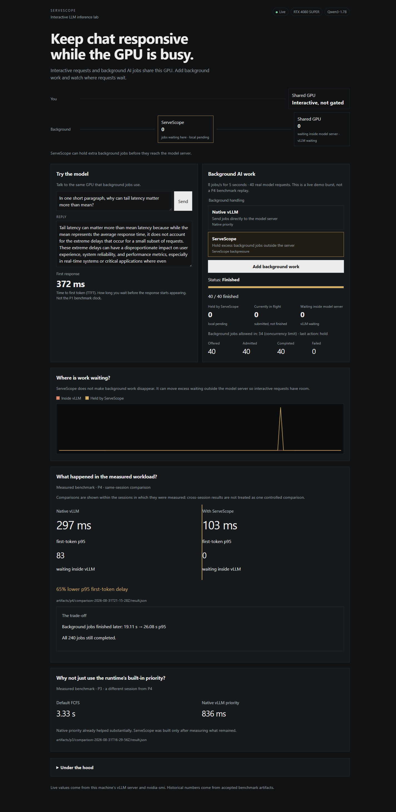

# ServeScope

ServeScope keeps interactive LLM requests responsive when background jobs share the same GPU, by controlling how much background work enters the inference server.



It is a local measurement lab on an RTX 4080 SUPER. It is not a production serving product and not a new inference runtime.

## Why I built it

One GPU can serve a person waiting on a reply and longer background jobs at the same time. If the background jobs flood the server, the person stares at a blank reply for seconds.

## What it does

- Streams real chat against a local OpenAI-compatible vLLM server
- Measures first-token latency with explicit client clocks
- Runs mixed interactive and background workloads on vLLM 0.28.0
- Compares vLLM's own `--scheduling-policy priority` against default FCFS
- Holds excess background work in an external admission queue (AIMD-style concurrency limit, not a vLLM scheduler)
- Shows the live experiment at `http://127.0.0.1:8080`

## Results

Two separate benchmark sessions. They are not one four-stage latency progression.

**Native priority baseline** (`artifacts/p3/comparison-2026-08-31T16-29-56Z/result.json`)

Default FCFS mixed burst p95 TTFT **3.33 s**. Native vLLM priority **836 ms**. Background work paid for it: p95 E2E about **12.8 s → 26.3 s**, output goodput about **2240 → 1583 tok/s**.

**External admission** (`artifacts/p4/comparison-2026-08-31T21-15-28Z/result.json`)

Native priority mixed burst p95 TTFT **297 ms**. ServeScope **103 ms**. Runtime waiting **83 → 0**. Peak local pending **137**. Background p95 total E2E **19.1 s → 26.1 s**. Output goodput **1869 → 1510 tok/s**. All 240 background jobs still finished.

The measured admission run never halved the concurrency limit (`decrease_count = 0`) because vLLM waiting stayed at zero. The improvement came from bounded admission itself. The decrease path exists and is unit-tested.

An earlier interactive-only sweep did not find a clean saturation cliff. At 128 RPS some valid repeats collapsed and others stayed near 70 ms. Details are in the notes.

## Run it locally

Expected setup: Windows + WSL2 Ubuntu, Python 3.12, an NVIDIA GPU with enough VRAM for `Qwen/Qwen3-1.7B` BF16, vLLM 0.28.0.

```bash
cd ~/serve-scope
source .venv/bin/activate
```

Terminal 1 starts the priority server:

```bash
scripts/_p3_start_priority.sh
```

Terminal 2 starts the lab:

```bash
python scripts/run_demo.py
```

Open `http://127.0.0.1:8080`. If vLLM is down, the page still renders and the recorded results stay visible. Live telemetry is marked unavailable rather than filled with zeros.

Live modes use the same already-running priority server:

- **Native vLLM:** background jobs go straight to the server at priority 1
- **ServeScope:** the same server, but background jobs wait in a local queue first

The browser cannot change `--scheduling-policy`. Default FCFS is recorded evidence only. The on-page burst is `8 jobs/s × 5 s = 40` real requests, not a replay of the 60-second benchmark.

```bash
python -m pytest tests/test_p1_metrics.py tests/test_p2_metrics.py tests/test_p3_metrics.py tests/test_p4_backpressure.py tests/test_demo_state.py tests/test_demo_evidence.py tests/test_demo_app.py tests/test_demo_orchestration.py -q
```

## How it works

Interactive chat (priority 0) always goes to vLLM. Background jobs (priority 1) either go there immediately or sit in ServeScope until the current concurrency limit has room. The controller watches `vllm:num_requests_waiting`. It does not cancel work already submitted.

## Benchmark notes

Workload definitions, clocks, validity rules, reproduction commands, and caveats are in [`docs/experiments.md`](docs/experiments.md).
